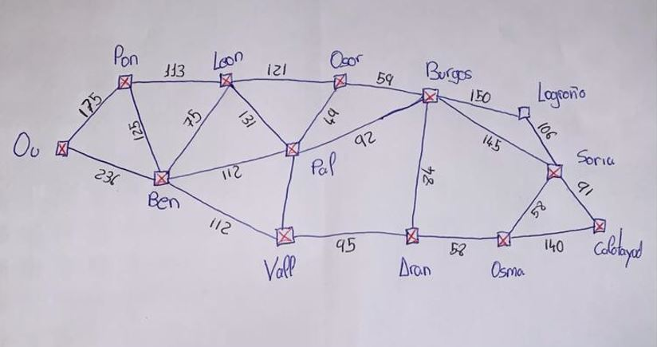
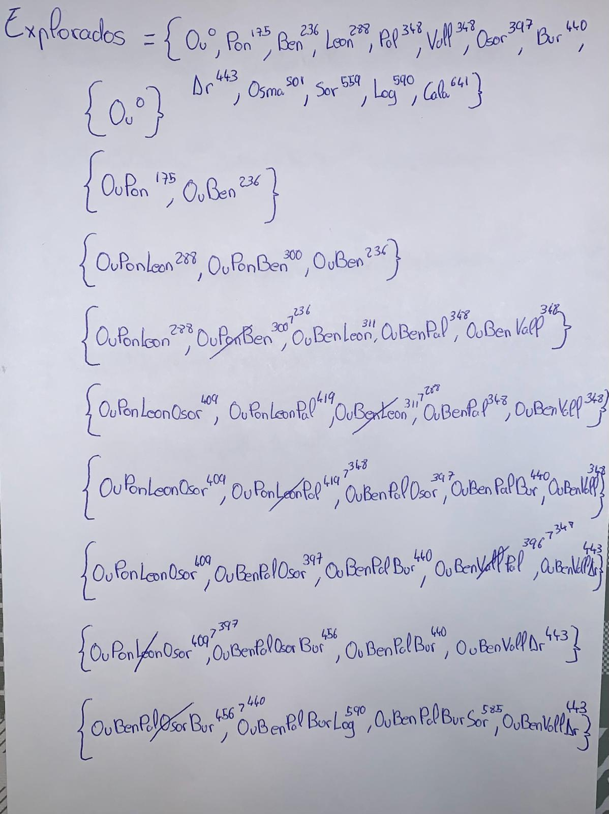
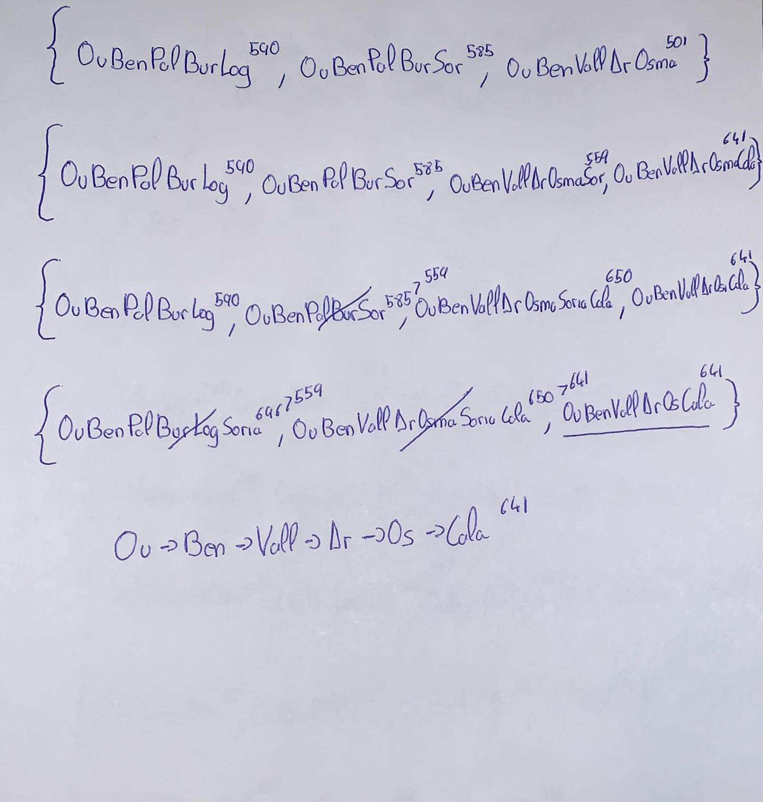
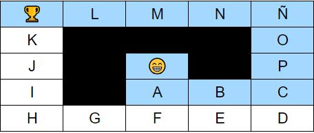
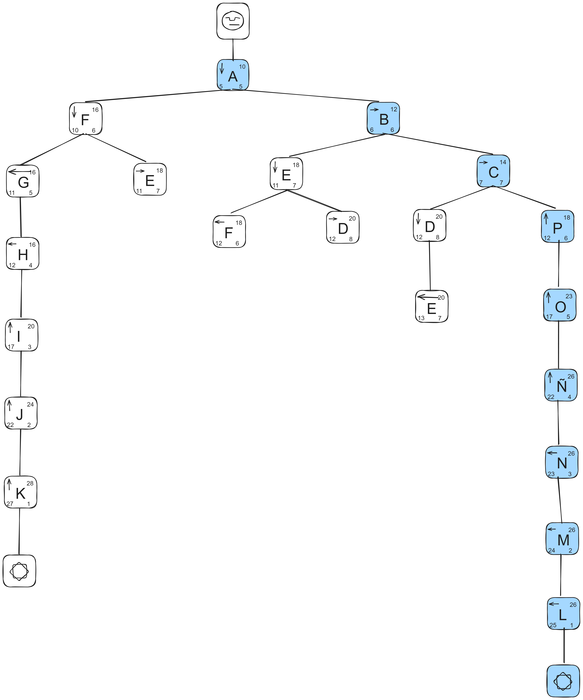
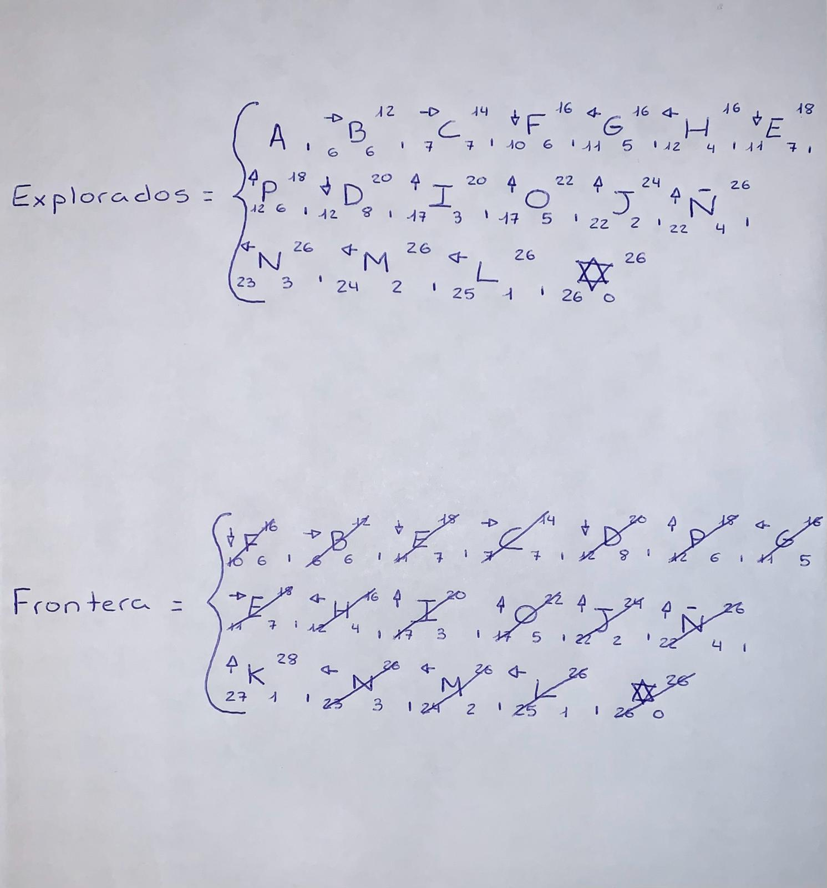

# Ejercicios_MIA
Prácticas del curso de especialización de Inteligencia Artificial y Big Data - IES de Teis

## Resolver o exercicio 2 do boletín mediante busca por COSTE UNIFORME

## Resolver o NPC c A*: Figure 3.8 The sequence of tree processing using A* search

